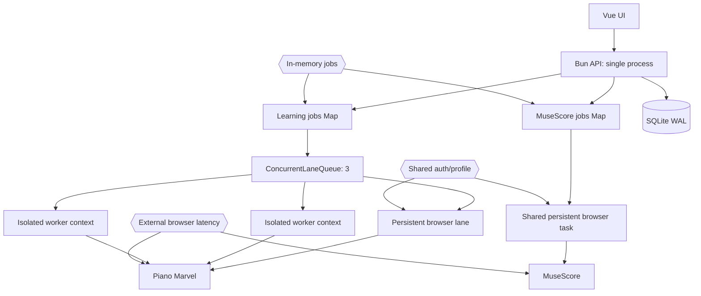

# Performance & Scalability Report

**Date**: 2026-07-21 23:26:25 MSK  
**Current Users**: 1 локальный пользователь, до 3 параллельных Learn tasks  
**Target Scale**: надёжная локальная очередь; справочная оценка для 3, 100 и 1000 пользователей

## Architecture Scalability Flow

Проект является desktop/local-first инструментом. Оценки 100/1000 пользователей не являются требованием текущего продукта; они показывают, где архитектурная граница. Масштабирование выше одного владельца потребует изоляции профилей, аутентификации, внешней очереди и отдельного worker plane, а не простого увеличения `LEARN_CONCURRENCY`.

## Database Analysis

### Schema Review

- SQLite содержит `cached_pieces`, `learning_status_cache`, `cache_meta`; primary keys достаточны для текущих lookup.
- WAL + `synchronous=NORMAL` подходят локальной desktop-нагрузке.
- `learning_status_cache` имеет один row на piece и версию алгоритма внутри row. При смене стратегии предыдущая запись перезаписывается; для сравнения алгоритмов и rollback лучше composite key `(piece_id, algorithm_version, strategy_id)`.
- Нет таблиц jobs, score analysis, generated plan, snapshots/rollback и learner telemetry.
- Session cookies хранятся в SQLite как JSON без прикладного шифрования. Для одного macOS-пользователя права файла частично защищают данные, но лучше хранить encryption key в Keychain.

### Query Performance

| Query Pattern | Current Impact | At 1000 Users | Recommendation |
| ------------- | -------------- | ------------- | -------------- |
| Полный каталог `ORDER BY piece_id` | Низкий, локальные сотни/тысячи rows | Полный scan/deserialize на каждый GET | Pagination, selected columns, ETag |
| Learning statuses + JS `Set` filter | Низкий локально | Читает все rows версии и фильтрует в памяти | SQL `WHERE piece_id IN (...)`; batch/pagination |
| `replaceCatalog`: DELETE + insert all | Приемлемо локально | Write contention и лишние записи | Diff/upsert + удаление отсутствующих IDs |
| Score structure analysis | Пока отсутствует | Повторный XML parsing дорог | Cache по SHA-256 файла и analyzer version |
| Job lookup | O(1), но Map растёт | Memory leak/process-local inconsistency | TTL pruning + persisted jobs/external queue |

### Indexing Strategy

- Текущие primary keys покрывают локальные запросы.
- При введении истории: index `(piece_id, algorithm_version, created_at DESC)`.
- Для jobs: index `(state, created_at)` и `(piece_id, state)`.
- Для score analysis: unique `(content_hash, analyzer_version)`.
- Для telemetry: index `(piece_id, measure_index, attempted_at)`; агрегаты хранить отдельно, чтобы UI не сканировал сырые попытки.

## Frontend Performance

### Bundle Analysis

- Production build: JS 197.99 kB / 67.78 kB gzip; CSS 53.36 kB / 10.25 kB gzip. Для локального приложения размер хороший.
- Основной риск не network bundle, а сложность компонентов: `MuseScoreMovement.vue` 969 строк, `PiecesMovement.vue` 966, `App.vue` 598.
- Route-level code splitting почти ничего не даст для одного локального экрана; полезнее разделить бизнес-состояние на composables и уменьшить реактивные области.

### Rendering Performance

- TanStack table подходит каталогу, но следует проверить реальную виртуализацию при десятках тысяч пьес.
- Reactive records для statuses/jobs разумны при сотнях rows. При больших каталогах обновление общих объектов и повторные computed filters нужно профилировать.
- Toast timers не являются узким местом, но stage timers и long-poll lifecycle должны гарантированно очищаться при unmount/navigation.

### State Management

- Long-poll по version эффективнее interval polling и уменьшает лишние запросы.
- Job state частично дублируется между `App.vue` и `PiecesMovement.vue`; единый composable/store снизит число watchers и расхождения UI.
- После перезагрузки страницы UI не может восстановить полную историю terminal jobs, а после рестарта сервера jobs исчезают.

## Backend Performance

### Request Handling

- Bun API лёгкий, SQLite синхронный доступ для текущего объёма приемлем.
- Browser automation доминирует по latency: один Learn task занимает десятки секунд, поэтому throughput задаётся lanes и внешним сайтом, не HTTP server.
- `GET /learning-jobs/:id` держит long-poll до изменения/abort; `idleTimeout: 120` покрывает этот pattern.
- MuseScore использует общий persistent browser queue, а Learn lane 0 также зависит от persistent profile. Одновременные workflows могут конкурировать за shared browser/auth lifecycle.

### Resource Utilization

- Три Chrome contexts дают реальный параллелизм, но память растёт примерно пропорционально concurrency и сложности партитур.
- Worker browser общий, contexts закрываются в `finally` — это хорошая защита от утечек.
- `jobs` Maps и terminal payloads никогда не удаляются.
- Diagnostics screenshots/dumps в `.data/learn-debug` не имеют retention policy и могут бесконечно занимать диск.
- MusicXML analysis regex-операциями многократно проходит всю XML-строку; для одной партитуры нормально, при batch import нужен single parse + cached feature extraction.

### Caching Strategy

- Catalog и verified learning status кэшируются корректно для local-first UX.
- `storageState` снимается один раз при подготовке workers. Изменение/истечение авторизации во время длинной очереди требует явного invalidation/reseed path.
- Не кэшируются структура партитуры, boundary candidates и final segmentation plan.
- Нет retention/version history для диагностики, jobs и старых learning algorithms.

## Scalability Projections

| Metric | 3 Users | 100 Users | 1000 Users | Mitigation |
| ------ | ------- | --------- | ---------- | ---------- |
| Learn concurrency | 3 tasks одновременно на одной машине | Очередь на десятки минут/часов | Практически непригодно | Отдельные browser workers, autoscaling, rate limits |
| Auth isolation | Один общий владелец; для разных пользователей уже неверно | Cookie/profile collision | Критическая утечка tenant context | Отдельный encrypted profile/storageState на user |
| Job durability | Потеря при restart терпима | Видимые потери задач | Массовая рассинхронизация | SQLite jobs локально; Redis/Postgres queue для сервиса |
| Memory | 3 contexts + растущие Maps | Десятки GB при прямом масштабировании | Невозможно одним процессом | Bounded workers, TTL, process isolation |
| SQLite writes | Хорошо | Single-writer contention | Неподходящий shared DB | Postgres для multi-user; SQLite оставить desktop edition |
| External sites | Нормально при аккуратной очереди | Rate-limit/CAPTCHA/ToS риски | Блокировки | Per-domain quotas, backoff по событиям/response, user-owned sessions |
| API security | Нужен localhost hardening | Нужна полноценная auth | Multi-tenant security mandatory | Bind localhost сейчас; auth/RBAC/audit для сервиса |
| XML analysis | Миллисекунды/секунды на import | Batch CPU заметен | Нужен worker pool | Hash cache, parsed IR, background analysis |

## Risk Matrix

| Risk | Probability | Impact | Priority | Mitigation |
| ---- | ----------- | ------ | -------- | ---------- |
| Потеря старого Learn Mode после reset + failure | High | High | P1 | Snapshot, preview, staged apply, rollback |
| LAN-доступ к browser-control API | High | High | P1 | `127.0.0.1`, Origin check, nonce |
| Красный typecheck скрывает API contract regressions | High | Med | P1 | Typed DTO + runtime schemas + CI gate |
| Неверные музыкальные границы и длинные review chunks | High | Med | P1 | Per-measure analysis + load/form optimizer |
| Утечка памяти jobs/diagnostics | Med | Med | P2 | TTL/pruning, disk retention |
| Истёкший worker `storageState` посреди очереди | Med | Med | P2 | Auth failure classifier + reseed/requeue |
| Shared persistent profile conflict Learn/MuseScore | Med | High | P2 | Domain-specific browser supervisors/profiles |
| Regex MusicXML неверно понимает repeats/voices | Med | High | P2 | XML parser + normalized score IR + fixtures |
| Увеличение concurrency вызывает throttling | Med | Med | P2 | Adaptive concurrency per domain, metrics |
| SQLite bottleneck в desktop edition | Low | Low | P3 | Не оптимизировать преждевременно; Postgres только для server edition |

## Action Items

### Immediate (P1)

1. Явно bind API к `127.0.0.1`; добавить Origin/nonce guard для mutating endpoints.
2. Исправить 12 TypeScript errors и сделать `bun run typecheck` обязательным quality gate.
3. Добавить snapshot + preview + rollback вокруг reset Learning Mode.
4. Ограничить `jobs` и diagnostics retention: TTL для terminal jobs, max age/size для debug artifacts.
5. Изменить review grouping так, чтобы хвост не терялся и существовал максимальный предел длительности/тактов даже до внедрения полной музыкальной модели.

### Short-term (P2)

1. Ввести cached `ScoreStructureAnalysis` по content hash и analyzer version.
2. Реализовать boundary optimizer и bridge chunks, покрыть MusicXML fixtures.
3. Вынести общий persisted/TTL job registry и единый frontend jobs composable.
4. Разделить MuseScore backend/UI монолиты.
5. Добавить метрики: queue wait, step duration, recovery count, failure reason, browser memory, success ratio по piece complexity.
6. Сделать reseed worker auth state событием после 401/login redirect, а задачу безопасно возвращать в очередь один раз.

### Long-term (P3)

1. Собирать learner telemetry и строить error heatmap/адаптивный curriculum.
2. Поддержать отдельные strategy profiles и A/B сравнение boundary quality.
3. Если появится multi-user версия, отделить API/control plane от browser worker plane, использовать внешнюю durable queue, Postgres и per-user encrypted sessions.
4. Добавить performance regression suite на партии 50/200/1000 тактов и каталоги 1k/10k/50k пьес.

