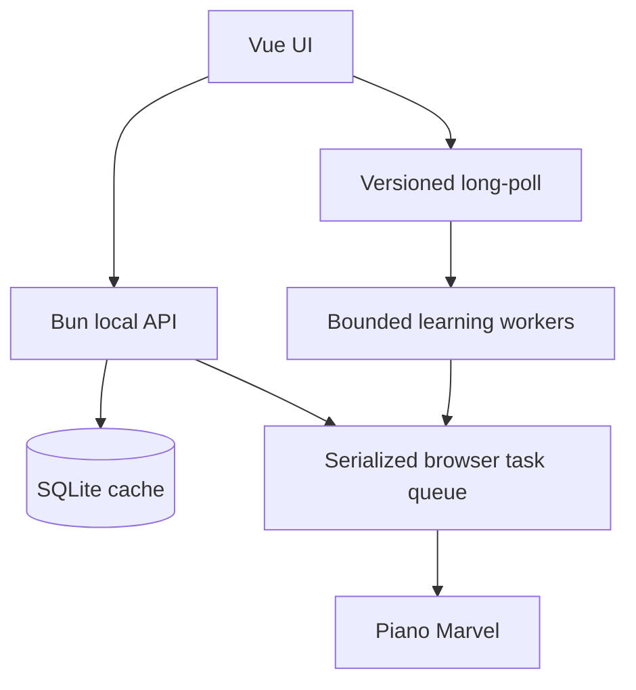

# Performance & Scalability Report

**Date**: 20260816_140124  
**Current Users**: 1–3 локальных оператора  
**Target Scale**: 100 каталогов / 1000 фоновых job-событий без деградации UI

## Architecture Scalability Flow

## Database Analysis

### Schema Review

- Каталог и learning status хранятся локально; старт не зависит от сети Piano Marvel.
- Батч `getLearningStatuses(ids)` предпочтительнее N+1 и уже используется.

### Query Performance

| Query Pattern | Current Impact | At 1000 Users/items | Recommendation |
|---|---|---|---|
| catalog + batch statuses | низкий | линейный JSON/DOM рост | сохранять batch, виртуализировать при >500 строк |
| status writes | низкий | конкурирующие версии | сохранять checkedAt latest-wins |
| score source lookup | O(1) по id | стабильно | без изменений |

### Indexing Strategy

- В текущем локальном масштабе дополнительных индексов не требуется.
- При каталоге >10k проверить index по `piece_id` и timestamps фактическим query plan.

## Frontend Performance

### Bundle Analysis

Baseline production build:

- main JS: 359.88 kB / 127.43 kB gzip;
- CSS: 208.07 kB / 36.69 kB gzip;
- lazy OSMD: 1,275.62 kB / 337.06 kB gzip.

OSMD уже lazy, но каталог и крупный parser viewer находятся в статическом component graph. Требуется дополнительное разделение чанков.

### Rendering Performance

- Живой авторизованный экран: около 2100 DOM nodes, 8 stylesheets.
- Найдены две бесконечные CSS-анимации на baseline и постоянный JS cursor RAF.
- Blur reveal, fixed grain/mix-blend и постоянный `will-change` увеличивают compositing/paint pressure.
- Глобальные MutationObserver повторно сканируют добавленные поддеревья; batching отсутствует.

### State Management

- `FingeringScore` использует requestVersion и последовательную paint queue — сильная сторона.
- App scan и catalog load/refresh требуют того же latest-wins pattern.
- Bulk learning удваивает long-poll consumers.

## Backend Performance

### Request Handling

- Общий Chrome profile правильно сериализован FIFO.
- Длительные job отдаются через versioned long-poll, что эффективнее interval polling.
- Отмена HTTP клиента не обязательно отменяет внешнее действие; UI обязан отдельно фильтровать stale response.

### Resource Utilization

- Основной потолок — один управляемый Chrome и внешняя latency Piano Marvel.
- Увеличение количества UI watchers не повышает throughput, а только создаёт лишние соединения.

### Caching Strategy

- SQLite cache — правильный слой для каталога/status/source.
- Browser-derived данные нельзя бесконтрольно распараллеливать; очередь важнее raw throughput.

## Scalability Projections

| Metric | 3 Users/items | 100 Users/items | 1000 Users/items | Mitigation |
|---|---|---|---|---|
| Initial DOM | приемлемо | 2k+ nodes | тяжёлый layout | pagination + content-visibility, затем virtualization |
| Job status connections | единицы | 2x при bulk | connection storm | один consumer на job |
| Browser operations | очередь короткая | минуты ожидания | неприемлемо | bounded queue, progress, backpressure |
| Client filtering | мгновенно | приемлемо | заметно на каждый keypress | debounce сейчас; worker/virtualization позже |
| Animation CPU | заметно на ноутбуке | не зависит от данных | постоянное | on-demand RAF + viewport pause |

## Risk Matrix

| Risk | Probability | Impact | Priority | Mitigation |
|---|---|---|---|---|
| stale auth/scan response | High | High | P1 | generation + AbortController |
| duplicate bulk watchers | High | High | P1 | explicit watcher ownership |
| idle cursor RAF | High | Medium | P1 | stop at convergence/hidden |
| initial bundle parse | High | Medium | P1 | async components |
| MutationObserver rescan storm | Medium | Medium | P2 | per-frame batching |
| large catalog layout | Medium | Medium | P2 | content-visibility; virtualization threshold |

## Action Items

### Immediate (P1)

1. LatestRequest для scan/catalog.
2. Последовательный auth polling.
3. Один watcher на bulk job.
4. Async PiecesMovement/FingeringScore.
5. On-demand cursor RAF и offscreen marquee pause.

### Short-term (P2)

1. Разнести App/Pieces orchestration по composables.
2. Добавить bundle budget в CI.
3. Включить performance marks вокруг scan/catalog/viewer paint.

### Long-term (P3)

1. Виртуализировать таблицу при фактическом каталоге >500 строк.
2. Перенести тяжёлый XML parsing в Web Worker, если замеры покажут long task >50 ms.

## Measured Result After P1

| Метрика | Baseline | После P1 | Результат |
|---|---:|---:|---:|
| Initial JavaScript (gzip) | 127,43 kB | 56,06 kB | -56,0% |
| Initial CSS (gzip) | 36,69 kB | 15,06 kB | -58,9% |
| DOM до открытия каталога | ~2100 узлов | 445 узлов | каталог не монтируется заранее |
| Каталог после открытия | ~2100 узлов | ~2100 узлов | `content-visibility: auto` снижает offscreen paint/layout |

Браузерная проверка подтвердила загрузку 21 строки каталога, переключение на локальный источник без ошибок консоли, `content-visibility: auto` и паузу offscreen-маркизы с возобновлением при появлении в viewport.

На масштабе 3/100/1000 одновременных пользователей фронтенд теперь не создаёт пересекающиеся login-status запросы внутри одной вкладки и отменяет устаревшие scan/catalog запросы. Серверная нагрузка от массового learning-long-poll уменьшается примерно вдвое относительно прежней клиентской схемы, потому что на одну задачу остаётся один watcher вместо двух. Это архитектурный вывод по числу запросов, а не production RUM-замер.
