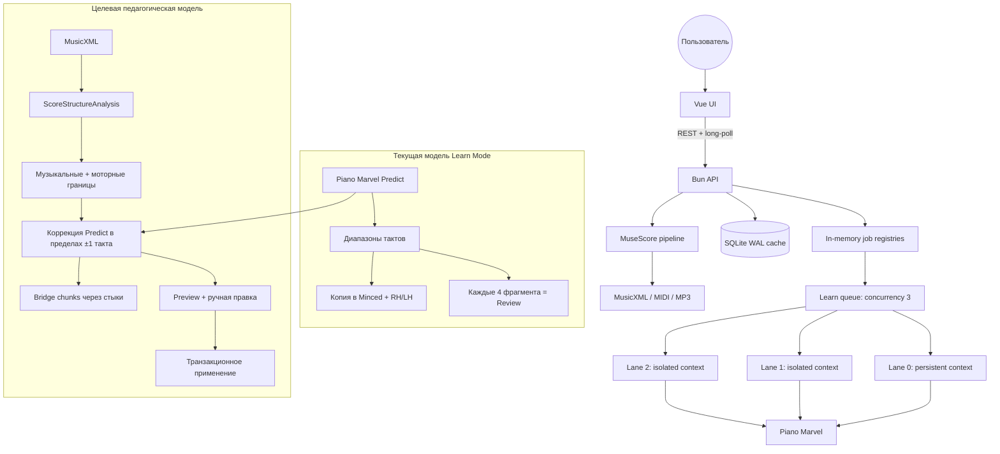

# Code Review: Адаптивная сегментация Learn Mode и общий аудит проекта

**Date**: 2026-07-21 23:26:25 MSK  
**Reviewer**: IT Architect Agent / ENI  
**Scope**: `server/learning-*`, `server/scoreAnalyzer.ts`, `server/cache.ts`, `server/index.ts`, `server/musescore*`, `server/browser*`, `src/App.vue`, `src/components/PiecesMovement.vue`, `src/components/MuseScoreMovement.vue`, тесты и сборка

## Executive Summary

Проект уже надёжно автоматизирует браузерный workflow: Learn Mode выполняется в трёх изолированных lanes, ожидания в основном привязаны к DOM/data/network-событиям, операции проверяются фактическим snapshot, а ошибки сопровождаются диагностикой. Однако педагогическая модель пока почти полностью делегирована кнопке Piano Marvel Predict: собственный код знает только диапазоны тактов, варианты рук и три фиксированных темпа, поэтому не различает мотив, фразу, каданс, смену фактуры, локальный технический пик и формальный раздел.

Главное направление развития — `ScoreStructureAnalysis`: детальный анализ MusicXML по тактам, корректировка границ Predict около музыкально и моторно сильных точек, отдельные переходные bridge-упражнения и предварительный просмотр плана до изменения существующего Learn Mode. До этого необходимо закрыть риск потери пользовательской схемы при warning, ограничить API локальным интерфейсом и восстановить чистый `typecheck`.

## Architectural Diagram

## Requirements Compliance

| Original Requirement | Implementation Status | Notes |
| -------------------- | --------------------- | ----- |
| Параллельное создание обучения, concurrency 3 | OK | `learning-workers.ts:8-66`: persistent lane + отдельные worker contexts со своим `localStorage` |
| Очередь для warning/missing | OK | FIFO lane queue, дедупликация активной задачи по `pieceId` |
| Ожидания по триггерам, не фиксированным паузам | OK/WARN | Learn Mode преимущественно event-driven; в `browser.ts`, `login.ts`, `musescore.ts` ещё остаются несколько `setTimeout`/poll-пауз |
| Надёжный Predict New Exercise | OK | Реализованы локальные mutation-триггеры, checkpoints, восстановление и аварийные ceilings |
| Toast процесса новой загрузки и Learn Mode | OK | Долгие операции отражаются job/toast состояниями; есть success/error ветки |
| Музыкально осмысленная сегментация Chopped | FAIL | `buildReviewChunks` группирует каждые четыре диапазона, а сами границы полностью задаёт внешний Predict |
| Адаптация под трудность конкретного места | FAIL | Есть только одна глобальная difficulty 1–18; нет per-measure feature vector |
| Сохранность ручных/старых упражнений | FAIL | Любой нестрого целевой warning полностью очищается перед построением новой схемы |
| Чистый TypeScript typecheck | FAIL | 12 ошибок `unknown` в `MuseScoreMovement.vue:150-206` |
| Тесты и production build | OK | 27/27 тестов проходят; Vite build проходит |

## Architectural Assessment

### Strengths

- `learning-workers.ts:14-65` правильно изолирует `localStorage.slicingData` между параллельными пьесами. Это ключевое архитектурное решение для безопасной многозадачности.
- Planner резюмируемый: после гибели страницы snapshot перечитывается и остаток плана строится заново (`learning-mode.ts:66-99`).
- Автоматизация Learn Mode использует сетевые и DOM/data-события; таймауты выступают верхней границей отказа, а не способом «угадать» готовность.
- SQLite работает в WAL/NORMAL, кэш отделяет каталог от проверенных learning-status и версионирует алгоритм (`cache.ts:37-61`, `107-144`).
- Есть структурированные логи, снимки экрана/состояния при падении и проверка конечной схемы.
- Unit-тесты покрывают planner, cleanup, cache, score analyzer, очередь и upload contract. Production bundle умеренный: 197.99 kB JS / 67.78 kB gzip.

### Concerns

#### 1. Chopped не использует музыкальную структуру

`SlicingExercise` содержит только `startMeasure`, `endMeasure`, `staffs`, `title` (`learning-plan.ts:3-8`). `predictChopped` принимает границы Piano Marvel, а проверка считает достаточным покрытие до конца Whole (`learning-plan.ts:190-198`). Поэтому два фрагмента одинаковой длины считаются одинаковыми, даже если один — простая секвенция, а другой содержит скачки, полиритм, смену позиции и кадансовое разрешение.

#### 2. Review «каждые четыре» — счётчик, а не педагогическая иерархия

`buildReviewChunks` объединяет строго четыре соседних фрагмента (`learning-plan.ts:155-170`). Это может:

- пересечь границу периода, репризы, тональности или фактуры;
- создать review на 4 такта или на 40 тактов в зависимости от исходного Predict;
- оставить хвост из 1–3 последних фрагментов без обзора;
- закрепить разрыв на стыке вместо умения соединять части.

Исследование профессиональных пианистов показывает, что именно стыки моторных chunks уязвимее внутренних позиций, а тренировка перехода снижает временные ошибки и нестабильность силы нажатия: [Bridging chunks during complex movement sequence execution](https://pmc.ncbi.nlm.nih.gov/articles/PMC12816802/). Следовательно, проекту нужны отдельные bridge chunks: последний такт A + первые 1–2 такта B.

#### 3. Музыкальная фраза и моторный chunk могут не совпадать

Музыкально естественная восьмитактовая фраза может содержать два-три разных двигательных паттерна. Экспериментальное исследование фортепианных гамм показывает, что одна воспринимаемая музыкальная фраза распадается как минимум на несколько моторных последовательностей: [Fingers Phrase Music Differently](https://pmc.ncbi.nlm.nih.gov/articles/PMC3499913/). Поэтому нельзя выбирать только гармонические или только технические границы; нужен двухслойный анализ и иерархия micro/chopped/review.

#### 4. Декомпозиция без точной обратной связи ограничена

Само разбиение полезно, но не гарантирует улучшение. В работе с опытными пианистами декомпозиция дала эффект при точной визуальной обратной связи по timing errors, тогда как простое повторение и декомпозиция без такой обратной связи не дали того же результата: [Decomposition of a complex motor skill with precise error feedback](https://doi.org/10.1038/s42003-025-07562-6). Значит, следующий педагогический уровень — собирать результаты попыток и выбирать chunks по реальным ошибкам ученика, а не только по нотному тексту.

#### 5. Warning сейчас означает разрушительное пересоздание

`runLearningMode` при любом состоянии, кроме `ok`, сразу вызывает полный reset (`learning-mode.ts:55-62`). Строгий validator отвергает любые дополнительные упражнения (`learning-plan.ts:85-120`), включая потенциально полезные ручные chunks. Перед reset нет dry-run, snapshot backup, preview или rollback. Ошибка после очистки оставляет только частично построенную новую схему.

#### 6. Анализ MusicXML слишком плоский

`ScoreAnalysis` хранит метаданные и одно число сложности (`scoreAnalyzer.ts:3-11`), а `estimateDifficulty` агрегирует плотность, ритм, голоса и диапазон по всей партитуре (`scoreAnalyzer.ts:185+`). Локальный пик теряется. Regex-парсинг ненадёжен для repeats/endings, нескольких voices, ties, pickups и `score-timewise`; перед педагогическим использованием нужен структурный XML parser и нормализованная шкала тактов.

#### 7. Накопившаяся концентрация ответственности

- `server/musescore.ts` — 1950 строк: браузер, авторизация, поиск, DOM fallback, скачивание, генерация форматов и анализ.
- `MuseScoreMovement.vue` — 969 строк; `PiecesMovement.vue` — 966; `App.vue` — 598.
- `server/index.ts` — 485 строк ручного route switching.
- `learning-jobs.ts` и `musescore-jobs.ts` почти дублируют Map/waiter/version long-poll pattern.

Это повышает стоимость изменения и вероятность неполных тестов на границах модулей.

#### 8. Type safety нарушена на API boundary

`readJson<T = unknown>` корректно возвращает `unknown`, но вызывающий код обращается к `data.error/results/job` без narrowing (`MuseScoreMovement.vue:150-206`). `vue-tsc --noEmit` падает с 12 ошибками. Нужны DTO-типы и runtime validation, иначе серверное изменение обнаруживается только в браузере.

#### 9. Локальный API фактически доступен сети

`Bun.serve` вызывается без `hostname` (`index.ts:102-107`), а документированный default Bun — `0.0.0.0`. При этом POST endpoints запускают браузерные действия в авторизованном профиле и не проверяют Origin/CSRF. Для local-first приложения следует явно слушать `127.0.0.1`, валидировать Origin и добавить сессионный nonce. Официальная справка: [Bun HTTP server configuration](https://bun.sh/docs/runtime/http/server).

#### 10. Job registry не ограничен и не переживает рестарт

Оба реестра хранят jobs в `Map` без TTL/pruning (`learning-jobs.ts:24-25`, `musescore-jobs.ts:32-33`). Терминальные jobs остаются до завершения процесса, активные теряются при рестарте. Для локального использования это не авария, но массовое «обновить всё» постепенно увеличивает память и лишает UI истории после перезапуска.

## Target Chopped Algorithm

### 1. Нормализовать MusicXML

Построить последовательность логических тактов с учётом затакта, повторов, first/second endings, смен размера и темпа. Отдельно хранить printed measure number и playback index, чтобы диапазоны Piano Marvel не съезжали.

### 2. Вычислить признаки каждого такта

- **Форма и фразировка**: rehearsal marks, двойные/финальные черты, repeats/endings, текстовые section labels, длинные rests, fermata/breath, окончание slur, смена темпа/размера/тональности.
- **Гармония**: harmonic rhythm, устойчивость баса, кадансовые признаки V–I/vii°–I/ii–V–I, разрешение задержаний, модуляция.
- **Моторика**: note density, кратчайшая длительность, chord size, диапазон/скачки каждой руки, смена позиции, повторные ноты, syncopation, tuplets, polyphony, hand crossings и независимость голосов.
- **Когнитивная нагрузка**: взвешенная сумма локальной сложности с отдельным штрафом за одновременное изменение нескольких параметров.

### 3. Выбрать границы оптимизацией, а не порогами-таймерами

Использовать candidate boundary score и dynamic programming. Жёсткие границы: section/repeat/ending/явный cadence/смена метра с паузой. Мягкие: 2/4/8-тактовая симметрия, завершение мотива, смена фактуры. Стоимость chunk должна учитывать длительность при учебном темпе и суммарную cognitive load, а не только число тактов.

Практичные ограничения для первой версии:

- Chopped: обычно 2–8 тактов или примерно 15–40 секунд на медленном темпе;
- трудный локальный пик: 1–2 такта;
- не резать tie/slur и не заканчивать непосредственно перед разрешением;
- если Predict boundary находится около хорошей точки, сдвигать максимум на ±1 такт;
- при низкой confidence оставить исходный Predict и показать предупреждение в preview.

### 4. Добавить иерархию

- **Minced / micro**: мотив, один технический жест или 1–2 трудных такта;
- **Chopped**: законченная subphrase/phrase с одной основной задачей;
- **Bridge**: перекрытие границы A→B;
- **Review**: музыкальный раздел или 2–4 Chopped с ограничением по суммарной нагрузке;
- **Whole**: форма целиком.

### 5. Адаптировать по ученику

Профиль `[60%, 80%, 100%]` (`learning-plan.ts:41-44`) оставить fallback. Если доступны accuracy, timing variance, число попыток и остановки, стартовый темп и размер chunks должны зависеть от фактических ошибок. Исследование tempo variability предупреждает, что случайное расширение диапазона темпов не универсально улучшает моторный перенос; режим изменения темпа следует выбирать осознанно: [Dissociable effects of practice variability](https://pubmed.ncbi.nlm.nih.gov/29494670/).

## Recommendations

### P0 — защита данных и корректность

1. До reset сохранять исходный `slicingData` snapshot и серверный payload; дать preview и явное подтверждение «перестроить».
2. Применять новую схему как staged operation; при ошибке восстанавливать сохранённый snapshot или хотя бы предлагать кнопку rollback.
3. Разделить validator на `required core`, `allowed generated extensions` и `manual extras`; наличие полезного extra не должно автоматически превращать схему в warning.
4. Исправить 12 ошибок typecheck через типизированные DTO + runtime guards.
5. Добавить `hostname: "127.0.0.1"`, проверку Origin и local session nonce.

### P1 — педагогическая версия 2

1. Ввести `ScoreStructureAnalysis` и хранить per-measure features в SQLite по hash MusicXML.
2. Оставить Piano Marvel Predict как baseline, затем согласовывать его границы с analysis.
3. Генерировать bridge chunks для каждого значимого стыка.
4. Заменить «каждые четыре» на load/form-aware reviews, включая последний неполный section.
5. Добавить UI preview: такты, длительность, причина границы, difficulty sparkline, confidence и ручное объединение/разделение.
6. Версионировать стратегию (`adaptive-learning-v2`) отдельно от status cache; не считать старую ручную схему ошибочной только из-за новой версии.

### P2 — адаптивность и качество проекта

1. Импортировать practice telemetry и строить error heatmap по тактам/переходам.
2. Добавить стратегии `Beginner`, `Balanced`, `Performance polishing`.
3. Вынести generic `VersionedJobRegistry<T>` с TTL/persistence из двух job-модулей.
4. Разделить MuseScore backend на `search`, `download`, `auth`, `format-generation`, `analysis`; Vue movements — на composables и малые компоненты.
5. Ввести schema validation на API boundary и route modules.
6. Добавить contract/E2E fixtures для MusicXML с repeats, pickup, meter/key changes, polyphony и corrupted exports.

## Quality Scores

| Criterion          | Score      | Justification |
| ------------------ | ---------- | ------------- |
| Code Quality       | 70/100     | Хорошие core-модули и тесты, но typecheck красный и есть три крупных монолита |
| Extensibility      | 58/100     | Planner расширяем, однако модель exercise слишком бедна, jobs/API/UI сцеплены |
| Security           | 48/100     | Local-first и нет внешней БД, но API слушает все интерфейсы и управляет авторизованным браузером без Origin/nonce |
| Performance        | 74/100     | Три lanes, WAL cache, long-poll; browser automation остаётся дорогой, jobs не очищаются |
| Architecture       | 66/100     | Удачная изоляция worker contexts, но дублирование jobs и крупные модули |
| Deploy Cleanliness | 59/100     | Build проходит, но typecheck нет; отсутствует Git metadata/CI в доступном workspace, есть platform-specific поведение |
| **TOTAL**          | **63/100** | Рабочая локальная автоматизация с крепким ядром, но без безопасной транзакционности и музыкальной модели |

## Critical Issues (Must Fix)

1. [CRITICAL] Любой warning удаляет существующую схему до полного построения и без rollback.
2. [CRITICAL] API по умолчанию доступен на `0.0.0.0` и способен выполнять действия в авторизованном браузере без Origin/CSRF-защиты.
3. [CRITICAL] `vue-tsc --noEmit` падает; типовой контракт MuseScore UI/server не контролируется компилятором.

## Recommendations (Should Fix)

1. [SHOULD] Реализовать MusicXML per-measure analysis и hierarchical chunks.
2. [SHOULD] Добавить bridge chunks и заменить механические review-группы.
3. [SHOULD] Сохранять manual extras и показывать preview/diff.
4. [SHOULD] Persist/prune jobs и извлечь общий job registry.
5. [SHOULD] Разделить `musescore.ts` и крупные Vue components.

## Minor Suggestions (Nice to Have)

1. [NICE] Давать фрагментам музыкальные имена из rehearsal marks: `A — ответ`, `Bridge to B`, `Cadence in G minor`.
2. [NICE] Показывать причину границы и confidence, чтобы педагог мог быстро проверить автоматический план.
3. [NICE] Добавить difficulty heatmap и фильтр «самые трудные переходы».
4. [NICE] Поддержать backward chaining для концов сложных фраз и случайный старт из внутренних опорных точек.

