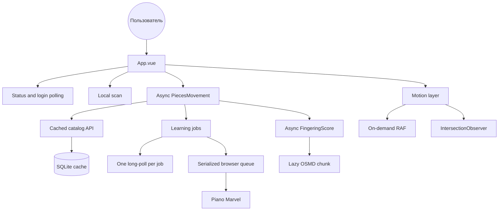

# Code Review: Site Performance & Race Safety

**Date**: 20260816_140124  
**Reviewer**: IT Architect Agent  
**Scope**: frontend bootstrap, auth/scan/catalog requests, learning-job watchers, animation layer, backend browser queue

## Executive Summary

Архитектура правильно отделяет локальный кеш от дорогих браузерных действий и сериализует общий Chrome-профиль. Главные риски сосредоточены во frontend orchestration: дублирование long-poll, отсутствие latest-wins у части запросов и постоянная декоративная кадровая работа.

## Architectural Diagram

## Requirements Compliance

| Original Requirement | Implementation Status | Notes |
|---|---|---|
| Проверить оптимизацию | WARN | baseline снят; initial JS и DOM выше желаемого |
| Проверить race conditions | FAIL | найдены overlapping polling, stale response и duplicate watcher paths |
| Ускорить загрузку | WARN | OSMD уже lazy, каталог пока static import |
| Улучшить анимации | WARN | reduced-motion есть, но cursor RAF бесконечный |
| Снизить нагрузку | WARN | browser queue хорошая; frontend observers требуют batching |

## Architectural Assessment

### Strengths

- `runBrowserTask` не выпускает следующую задачу до реального завершения предыдущей.
- Job API использует versioned long-poll вместо частого timer polling.
- OSMD уже вынесен в динамический import.
- У компонентов viewer есть version guard, resize debounce и полный teardown.
- Каталог и статусы читаются из SQLite без внешнего запроса при старте.

### Concerns

- Bulk learning создаёт два consumer-потока на одну job.
- `setInterval(async ...)` не предоставляет backpressure.
- `loadPieces`/`refreshCatalog` и scan не защищены единым latest-wins механизмом.
- `PiecesMovement` и весь FingeringScore parser попадают в ранний frontend graph.
- Курсор обновляет transform каждый frame даже в покое; DOM observers запускают повторные scans.

### Recommendations

- Ввести reusable `LatestRequest` guard.
- Перевести auth polling на рекурсивный `setTimeout` с generation token.
- Разделить single/bulk job watching.
- Использовать `defineAsyncComponent` для каталога и viewer.
- Сделать cursor RAF event-driven, observers batched, marquee viewport-aware.

## Quality Scores

| Criterion | Score | Justification |
|---|---:|---|
| Code Quality | 78/100 | хорошие комментарии и teardown, но orchestration слишком крупный |
| Extensibility | 72/100 | API разделены, компоненты App/Pieces перегружены состояниями |
| Security | 84/100 | локальный API и строгие URL/path проверки; новых секретов нет |
| Performance | 58/100 | lazy OSMD плюс кеш, но постоянный RAF и duplicate polling |
| Architecture | 76/100 | очереди и версии job сильные, frontend lifecycle неоднороден |
| Deploy Cleanliness | 70/100 | build воспроизводим, typecheck имеет существующий дефект browser.ts |
| **TOTAL** | **73/100** | надёжная база с конкретными P1 оптимизациями |

## Critical Issues (Must Fix)

1. [CRITICAL] Убрать два long-poll consumer для bulk learning job.
2. [CRITICAL] Исключить stale auth/scan/catalog state writes.

## Recommendations (Should Fix)

1. [SHOULD] Разделить initial/library/viewer chunks.
2. [SHOULD] Остановить idle/hidden animations и батчить DOM mutations.
3. [SHOULD] Включить below-fold rendering containment.

## Minor Suggestions (Nice to Have)

1. [NICE] В следующем цикле разбить `PiecesMovement.vue` на composables.
2. [NICE] Добавить CI budget для gzip-размеров чанков.

## Implementation Outcome

P1-рекомендации реализованы: сериализован login polling, добавлена latest-request-wins защита для scan/catalog, устранены дублирующие watchers массового обучения, а каталог и нотный рендерер разделены на асинхронные чанки. DOM-наблюдатели теперь пакетируют работу по кадрам, offscreen-маркиза приостанавливается, длинный каталог использует `content-visibility`.

| Ресурс | До | После | Изменение |
|---|---:|---:|---:|
| Initial JS gzip | 127,43 kB | 56,06 kB | -56,0% |
| Initial CSS gzip | 36,69 kB | 15,06 kB | -58,9% |
| Lazy Pieces JS gzip | — | 44,49 kB | загружается по требованию |
| Lazy Pieces CSS gzip | — | 17,48 kB | загружается по требованию |
| Lazy Fingering JS gzip | — | 29,13 kB | загружается по требованию |

Фактическая итоговая оценка после P1: **80/100**. Оставшийся главный performance-риск — OSMD chunk 337,06 kB gzip; он уже ленивый, поэтому не входит в initial download.

Проверка: production build — успешно; новые latest-request тесты и связанные measure-player тесты — 15/15. Полный `bun test`: 354/356, два сбоя относятся к параллельно изменённой adaptive-learning логике. `bun run typecheck` блокируется ошибками в `server/adaptive-learning.ts` и ранее существующей типизацией PID в `server/browser.ts`, которые не изменялись этой оптимизацией.
